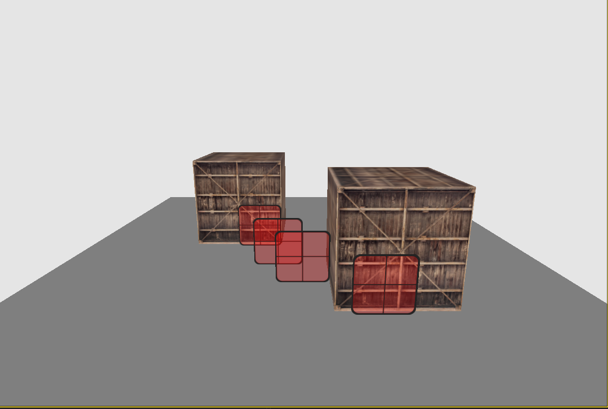
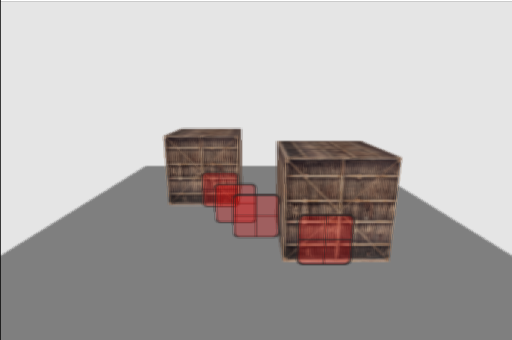
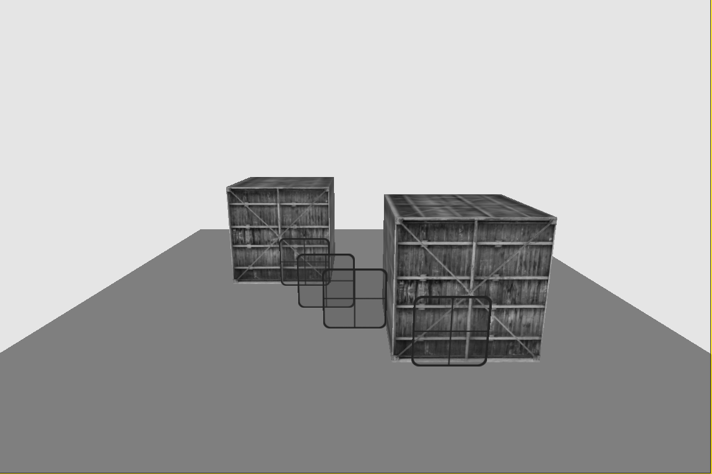
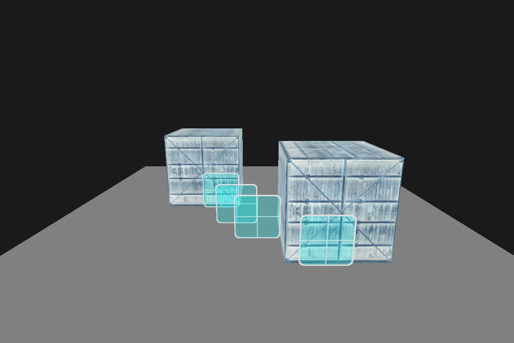
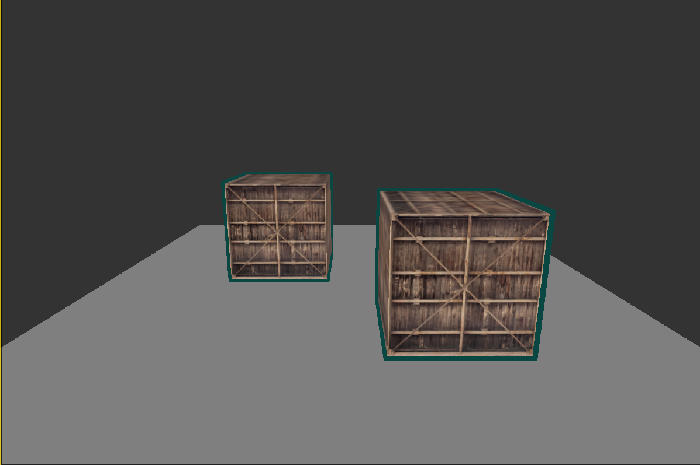

NOTE: In order to run the project, you have to change the solution platform to x86

I tried to learn about these topics in this project:

- Depth test, see how z buffer works
- Stencil test (and use it with an example)
- Blending
- Framebuffers
- Post process effects

Scene:
  
Blur:
 
Grayscale:
 
Inversion:
 
Stencil:
 

In this project I used
- "learnopengl.com" site for documentation. Some code lines on the site may be occur also in my project too.