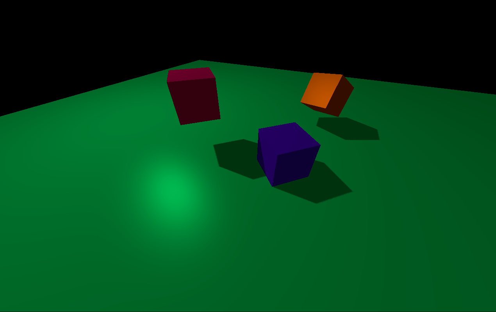
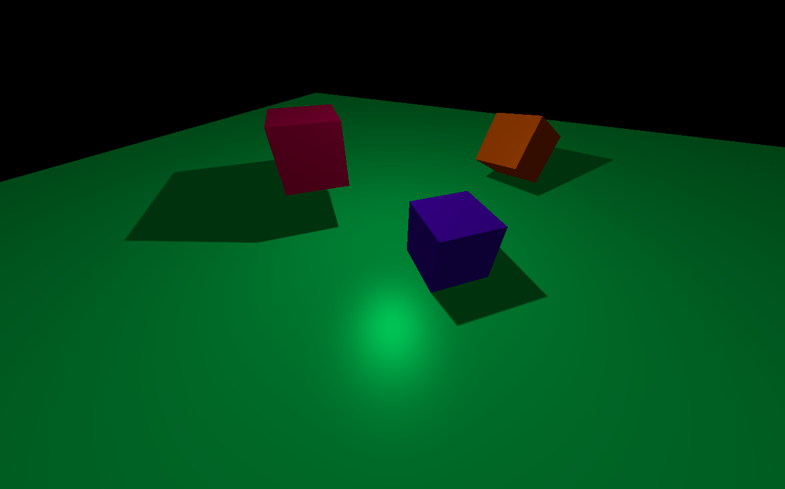

NOTE: In order to run the project, you have to change the solution platform to x86

In this project, the techniques I used:
- Shadow mapping
- Directional light shadows
- Point light shadows

Directional Light Shadow:
  
Point Light Shadow:
  
PCF:
  

In this project I used:
- learnopengl.com" site for documentation. Some code lines on the site may be occur also in my project.